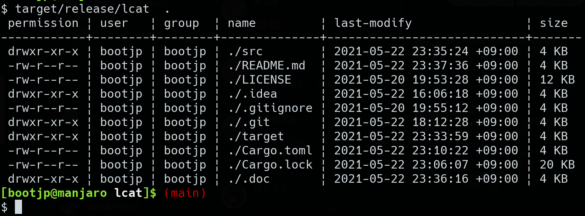
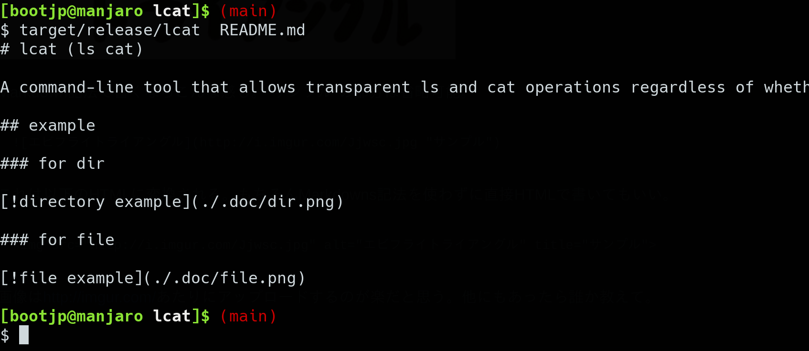

# bcat (ls cat renamed bcat)

A command-line tool that allows transparent ls and cat operations regardless of whether they are files or directories.

Also for practicing Rust.

## install

```sh
curl -LO https://github.com/bootjp/bcat/releases/latest/download/bcat
chmod +x bcat
./bcat .
sudo cp bcat /usr/local/bin/
```

## example

### for dir



### for file


